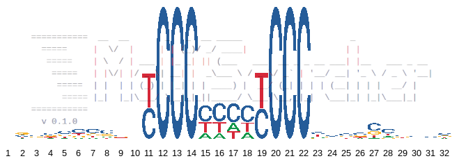

# Insights Into The Mechanisms Of AML Del9q Progression
> Analysis of hnRNP K interacting RNAs in myeloid KG-1a cellsn

HNRNPK is part of the minimally deleted region (MDR) in AML del(9q). To understand the function of hnRNP K in pathogenesis of this AML subtype, we analyzed the function of hnRNP K as an RNA binding protein in myeloid cells. Co-immunoprecipitated RNAs from hnRNP K and non-related control immunoprecipitation as well as input RNA were subjected to next generation sequencing. This analysis revealed an specific interaction of hnRNP K with 1076 RNAs, among them many mRNAs encoding transcription factors involved in myeloid differentiation and AML pathogenesis.


## Installing / Getting started

**Software requirements:**</BR>

**1. Java**</BR>
Java 8

**2. R**</BR>
To run the R markdowns you need, besides the core installation of R 4.0, the following R-Libraries:</BR>
1. biomaRt
2. DT
3. genefilter
4. tidyverse
5. ggplot2
6. ggseqlogo
7. cowplot
8. DESeq2
9. RColorBrewer
10. svglite

## Usage instructions
### 1. Running Downstream analysis

### 2. Running MotifSearcher
The first step is to take the 1076 transcripts and perform Motif matching using our MotifSearcher program. In the following,</BR>
we print the help section of the program, describing its usage.

```shell
            ===========  __  __       _   _  __ _____                     _               
              =====  	|  \/  |     | | (_)/ _/ ____|                   | |              
               =====	| \  / | ___ | |_ _| || (___   ___  __ _ _ __ ___| |__   ___ _ __ 
 	        =====	| |\/| |/ _ \| __| |  _\___ \ / _ \/ _` | '__/ __| '_ \ / _ \ '__|
                 =====	| |  | | (_) | |_| | | ____) |  __/ (_| | | | (__| | | |  __/ |   
 	          ===== |_|  |_|\___/ \__|_|_||_____/ \___|\__,_|_|  \___|_| |_|\___|_|   
            ===========
              v 0.1.0

MotifMatching (0.1.0) 
Copyright (c) 2020 Ali T. Abdallah, All rights reserved.
-------------------------------------------------------------------------------

'MotifMatching' detects and counts all matches of one or multiple motifs in one
or multiple regions of one or multiple gene products.

The commands below should be preceded by 'java -jar':

Usage:
MotifMatching.jar
-i  INPUT_FILE_PATHS
	  [-n names]
-o  OUTFILE
	  -m MOTIFS_DEFINITION
    [options]
MotifMatching -h | --help | --version

Arguments:
i   a list of comma separated absolute paths of fasta files each of which
    containing one or multiple sequences from the same genomic region.\n"+
    The header is expected to follow the fasta format guidelines, " + 
n   a list of comma separated names of these files/regions [optional]
	  otherwise the names of the files are taken as standard names.
o   the absolute path of the output file.
m   A list of regular expressions defining the motifs to search for.
	  Optionally it is possible to add to each motif a size limitation
	  by adding {size} to each motif definition in the list. For example:
	  [CT]CCC*[CT]CCC*{19},[CT]CCC*[CT]CCC*[CT]CCC*[CT]CCC{38}.
	  In this example the algorithm will look for all instances of the first
	  motif having a size less than 19 and all instances having a size less
	  than 38.";
```
### 3. Running SequenceLogoGenerator script


Here you should say what actually happens when you execute the code above.

### Initial Configuration

Some projects require initial configuration (e.g. access tokens or keys, `npm i`).
This is the section where you would document those requirements.

## Developing

Here's a brief intro about what a developer must do in order to start developing
the project further:

```shell
git clone https://github.com/your/awesome-project.git
cd awesome-project/
packagemanager install
```

And state what happens step-by-step.

### Building

If your project needs some additional steps for the developer to build the
project after some code changes, state them here:

```shell
./configure
make
make install
```

Here again you should state what actually happens when the code above gets
executed.

### Deploying / Publishing

In case there's some step you have to take that publishes this project to a
server, this is the right time to state it.

```shell
packagemanager deploy awesome-project -s server.com -u username -p password
```

And again you'd need to tell what the previous code actually does.

## Features

What's all the bells and whistles this project can perform?
* What's the main functionality
* You can also do another thing
* If you get really randy, you can even do this

## Configuration

Here you should write what are all of the configurations a user can enter when
using the project.

#### Argument 1
Type: `String`  
Default: `'default value'`

State what an argument does and how you can use it. If needed, you can provide
an example below.

Example:
```bash
awesome-project "Some other value"  # Prints "You're nailing this readme!"
```

#### Argument 2
Type: `Number|Boolean`  
Default: 100

Copy-paste as many of these as you need.

## Contributing

When you publish something open source, one of the greatest motivations is that
anyone can just jump in and start contributing to your project.

These paragraphs are meant to welcome those kind souls to feel that they are
needed. You should state something like:

"If you'd like to contribute, please fork the repository and use a feature
branch. Pull requests are warmly welcome."

If there's anything else the developer needs to know (e.g. the code style
guide), you should link it here. If there's a lot of things to take into
consideration, it is common to separate this section to its own file called
`CONTRIBUTING.md` (or similar). If so, you should say that it exists here.

## Links

Even though this information can be found inside the project on machine-readable
format like in a .json file, it's good to include a summary of most useful
links to humans using your project. You can include links like:

- Project homepage: https://your.github.com/awesome-project/
- Repository: https://github.com/your/awesome-project/
- Issue tracker: https://github.com/your/awesome-project/issues
  - In case of sensitive bugs like security vulnerabilities, please contact
my@email.com directly instead of using issue tracker. We value your effort
to improve the security and privacy of this project!
- Related projects:
  - Your other project: https://github.com/your/other-project/
  - Someone else's project: https://github.com/someones/awesome-project/


## Licensing

One really important part: Give your project a proper license. Here you should
state what the license is and how to find the text version of the license.
Something like:

"The code in this project is licensed under MIT license."
